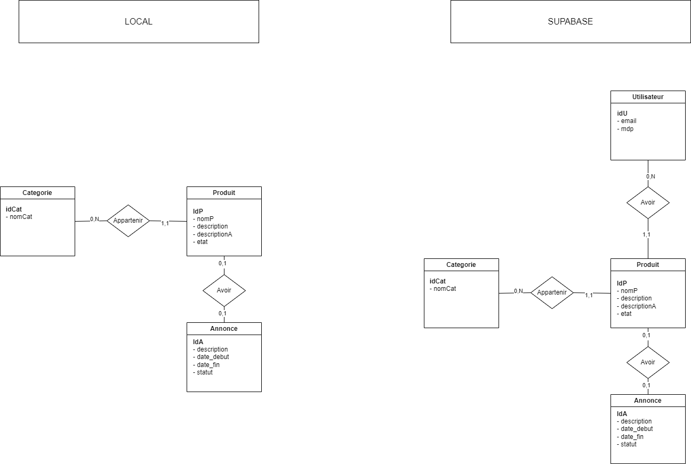
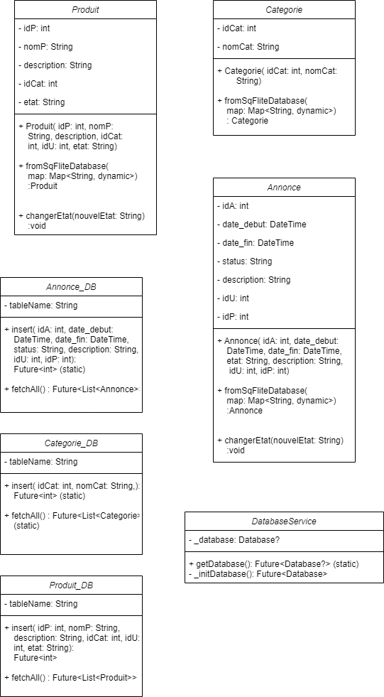

# README - Application ALL'O

## Groupe
- Malleron Daniel
- Pigoreau Nathan

## Description
ALL'O est une application mobile conçue pour faciliter le prêt et l'emprunt de divers articles entre étudiants ou apprentis au sein d'une communauté proche. L'application permet aux utilisateurs de publier des demandes d'articles dont ils ont besoin ou d'offrir des articles qu'ils peuvent prêter. Elle favorise la collaboration et le partage des ressources au sein de la communauté, facilitant ainsi l'accès à l'équipement, la recherche d'assistance ou la fourniture d'aide aux autres.

## Pour commencer
Pour commencer avec ALL'O, suivez ces étapes :

1. Clonez le dépôt depuis GitHub ou GitLab.
2. Assurez-vous d'avoir Flutter installé sur votre environnement de développement.
3. Configurez Supabase pour l'authentification et le stockage conformément à la documentation fournie.
4. Configurez les préférences partagées (Shared Preferences) et/ou sqflite pour le stockage local des données.
5. Exécutez l'application sur un émulateur ou un appareil physique.

## Fonctionnalités
- **Authentification des utilisateurs**: Les utilisateurs peuvent créer un compte ou se connecter de manière sécurisée.
- **Publication de demandes**: Les utilisateurs peuvent publier des demandes d'articles dont ils ont besoin, en spécifiant la catégorie de l'article.
- **Offre d'articles**: Les utilisateurs peuvent offrir des articles qu'ils peuvent prêter à d'autres.
- **Consultation des annonces**: Les utilisateurs peuvent consulter toutes les annonces disponibles et répondre aux demandes.
- **Gestion des réservations**: Les utilisateurs peuvent gérer leurs réservations et voir leurs prêts en cours.
- **Notifications**: Les utilisateurs reçoivent des notifications pour les nouvelles demandes ou les réponses.
- **Intégration de l'agenda personnel**: Intégration avec les agendas personnels pour la gestion des périodes de prêt.
- **Alertes**: Les alertes notifient les utilisateurs des dates limites de prêt imminentes.

## Évolutions possibles
Voici quelques améliorations potentielles pour le développement futur :

- Offrir des services en plus du prêt d'articles.
- Ajouter la prise en charge des photos pour les commentaires et les offres de service.
- Implémenter une fonction de recherche pour les annonces.
- Intégrer la synchronisation avec le calendrier pour la gestion des réservations.
- Ajouter des alertes pour les dates limites de prêt imminentes.

## Contraintes
- **Intégration de Supabase**: Utilisation de Supabase pour l'authentification, le stockage des annonces et les avis des utilisateurs.
- **Stockage local**: Utilisation des préférences partagées (Shared Preferences) et/ou sqflite pour le stockage local des données.
- **Gestion des états**: Implémentation de la gestion des états pour les annonces, les articles et les prêts.
- **Navigation**: Implémentation d'une navigation cohérente et ergonomique, potentiellement en utilisant go_router.

## Documentation
La documentation suivante est disponible :

- **Modèle conceptuel de données**: Modèle pour les bases de données centrales et locales.
- **Diagrammes d'états**: Diagrammes illustrant les états de divers objets.
- **Diagrammes de classes**: Diagrammes illustrant les classes de ces objets.
- **README**: Ce document.

## Travail réaliser

- **Modèle conceptuel de données**: Modèle pour les bases de données centrales et locales.
- **Diagrammes d'états**: Diagrammes illustrant les états de divers objets.
- **Diagrammes de classes**: Diagrammes illustrant les classes de ces objets.
- **README**: Ce document.
- **Connexion et inscription**: Connexion et inscription des utilisateurs. (Utilisation de auth de supabase)
- **Reset password**: Réinitialisation du mot de passe. (Utilisation de auth de supabase)
- **CR des annonces**: Création, lecture des annonces. (Lier avec supabase)
- **Produits** : Lecture des Produits.
- **Base de données Locale**: Utilisation de sqflite pour stocker les annonces localement.
- **Utilisation de go router**: Utilisation de go router pour la navigation.

## MCD

## Diagramme de classe

## Vidéos présentant le travail réalisé

## Contrainte de temps
Nous avons trouver que les 6h initialement prévu pour réaliser ce projet était clairement insuffisante, meme si nous pouvions travailer les week-end, la charge de travail deja présente pour les cours et les autres projets nous ont empêcher de travailler  autant que nous l'aurions souhaité. Nous rendons donc un projet qui n'est pas complet mais les compétences acquises durant ce projet, tels que, l'utilisation de supabase, sqflite, go_router, nous seront très utiles pour nos futurs projets.

## Licence
Ce projet est sous licence [MIT License](LICENSE).
